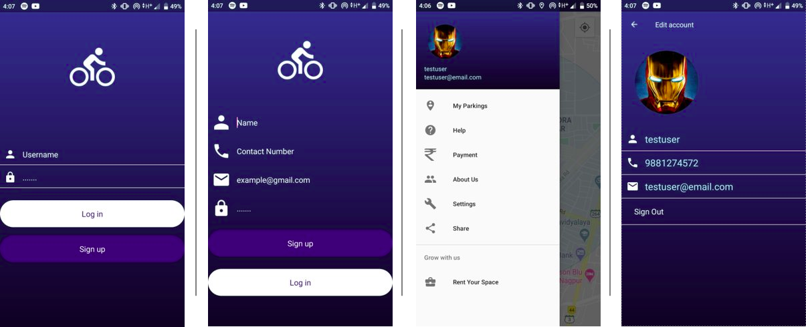

# Smart Parking System

The project provides an organized parking solution to automate the existing process of parking in India.

## How it works

1. Real time data collected from the sensors deployed across different parking systems (containing parking slots) is uploaded on Google's Firebase real time database. 
2. Using this Firebase real time database, availability of parking slots in a system is provided to the user in an android app (consisting of Google Maps API). 
3. The user can book a slot near him as parking systems with available parking slots were shown with colored markers in the app.
4. Once the user confirms his booking, a QR code is generated by the app which is to be scanned on reaching the parking space.
5. The user can then either navigate himself/herself to the destination or can ask the app to provide the navigation.
6. Once the user reaches the destination (parking space), he/she needs to provide the auto-generated QR in the app for scanning.
7. The system then scanes the QR and allots the nearest slot available to the user.
8. Once the user parks his/her car, the sensors deployed send data to the microcontroller only as long as the car is present.
9. When the user is leaving, he/she needs to scan the QR code again to generate billing details. So, the user is charged only for the stipulated amount of time he/she used the parking slot.
10. Since parking bills are very low, we plan to incorporate in-app payment solutions so that users can pay their parking bills on monthly basis.
11. Provision is also made for the user to rent out available space for parking that he/she owns.
12. Sensors are required if we wish to provide slot numbers to users on their arrival or to check which slot is available. The use of sensors can also be avoided as we already use two time scanning process that helps us to evaluate total time the vehicle is parked and the bill can be generated based on the time difference between the two scans.
13. The barricade opens only after successful scanning of the QR code and the code expires after two time scan and even if it isn't used within 2-3hrs. This is done to avoid blocking of slot.
14. The user can also view his bookings in My Parking section in Navigation Drawer.

## Software and Hardware Requirements
1. [Android Studio](https://developer.android.com/studio)
2. Internet Connectivity
3. Microcontroller Board - Either [RPi](https://www.raspberrypi.org/) or [ESP8266](https://www.espressif.com/en/products/socs/esp8266/overview) or any other board with built-in wifi module.
4. Servo motor if using baricade (for small demo you can use sticks).
5. Sensors (Any one type) - IR, Ultra Sonic, PIR or any other motion detecting sensor to detect car's presence. One can also use overhead camera for object (car) detection.  
6. Please use your own [Google Map's API](https://developers.google.com/maps/documentation).

## Getting Started and Learning Resources

1. Download the code and import it in android studio. Set up your firebase database and configure the app to use firebase database. Run the app using emulator or using real mobile.
2. Download/Write script for microcontroller for car detection. If sensors are being used, make sure to mention correct port nos. in script. Run the script using `python <script_name>.py` 
3. [Installation and Setup of Operating System (Raspbian) - Raspberry Pi](https://www.youtube.com/watch?v=4z9trGhCbfk&list=PLQVvvaa0QuDesV8WWHLLXW_avmTzHmJLv&index=2)
4. [Remote Access with SSH and Remote Desktop - Raspberry Pi](https://www.youtube.com/watch?v=IDqQIDL3LKg&list=PLQVvvaa0QuDesV8WWHLLXW_avmTzHmJLv&index=3)
5. [GPIO Basics with LED light - Raspberry Pi](https://www.youtube.com/watch?v=WLo5Rgvj6qo&list=PLQVvvaa0QuDesV8WWHLLXW_avmTzHmJLv&index=6)
6. [Raspberry Pi and Firebase integration](https://medium.com/@dvd.ciri/raspberry-pi-firebase-home-automation-d5a237f18fb5)
7. [Android and Firebase integration](https://firebase.google.com/docs/android/setup)

## Advantages of this system

1. Optimized parking – Users find the best spot available, saving time, resources and effort. The
parking lot fills up efficiently and space can be utilized properly by commercial and corporate
entities.
2. Reduced traffic – Traffic flow increases as fewer cars are required to drive around in search of an
open parking space.
3. Reduced pollution – Searching for parking burns around one million barrels of oil a day. An optimal
parking solution will significantly decrease driving time, thus lowering the amount of daily vehicle
emissions and ultimately reducing the global environmental footprint.
4. Enhanced User Experience – A smart parking solution will integrate the entire user experience into
a unified action. Driver’s payment, spot identification, location search and time notifications all
seamlessly become part of the destination arrival process.
5. New Revenue Streams – Many new revenue streams are possible with smart parking technology.
For example, lot owners can enable tiered payment options dependent on parking space location.
6. In addition, reward programs can be integrated into existing models to encourage repeat users.
7. Integrated Payments – Returning users can replace daily, manual cash payments with account
invoicing and application payments from their phone. This could also enable customer loyalty
programs and valuable user feedback.
8. Increased Safety – Parking lot employees and security guards contain real-time lot data that can
help prevent parking violations and suspicious activity. In addition, decreased spot-searching
traffic on the streets can reduce accidents caused by the distraction of searching for parking.
9. Real-Time Data and Trend Insight – Over time, a smart parking solution can produce data that
uncovers correlations and trends of users and lots. These trends can prove to be invaluable to lot
owners as to how to make adjustments and improvements to drivers.
10. Decreased Management Costs – More automation and less manual activity saves on labor cost and
resource exhaustion.
11. Increased Service and Brand Image – A seamless experience can really skyrocket a corporate or
commercial entities brand image to the user. Whether the destination is a retail store, an airport
or a corporate business office, visitors will surely be impressed with the innovative technology and
convenience factors.

## Additional Notes

1. This project started as an academic project in Feb 2018 and with additional brainstorming we've reached till here.
2. We used IR sensors to measure presence of car parked and servo motors for baricades. Object (Car in this case) detection can also be carried out using other resources like overhead camera, ultra sonic sensors, etc.
3. This project is purely built on native android.
4. We used Arduino Uno as microcontroller board for demo purpose. For more I/O ports, RPi can also be used.

## In Progress

1. In-app payment solutions
2. Database optimization
3. Code refactoring
